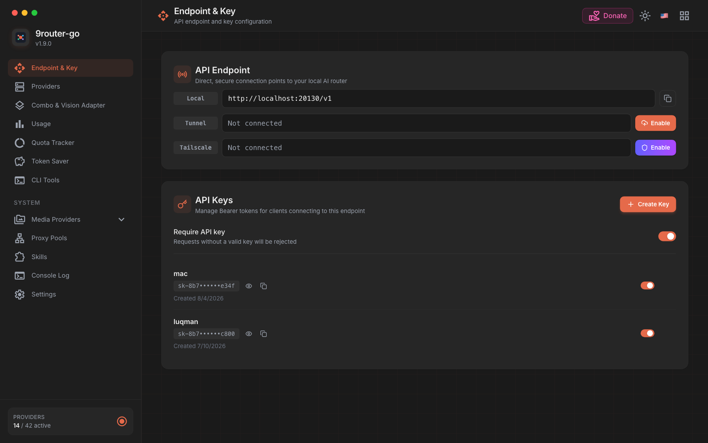
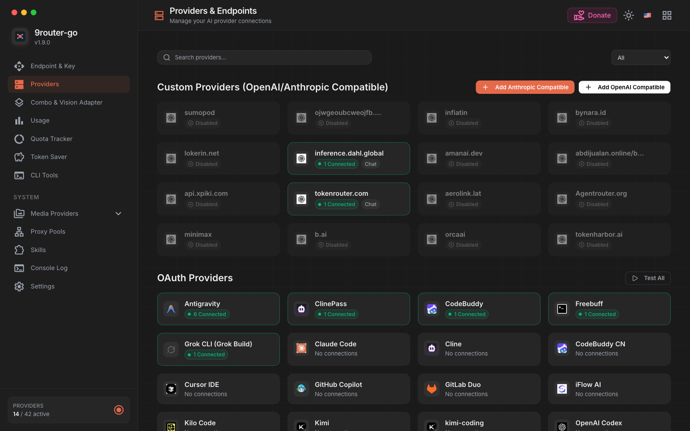

# 9router-go

[](https://github.com/luqman-v1/9router-go/actions/workflows/ci.yml)
[](https://github.com/luqman-v1/9router-go/actions/workflows/release.yml)

All-in-one AI gateway in Go: high-throughput LLM proxy **plus built-in dashboard** — no Next.js needed. Open `http://localhost:20130` after starting the binary.

> **Sync:** `v1.9.1` ↔ `decolua/9router v0.5.85` — see `CHANGELOG.md` & `ARCHITECTURE.md` for details.

- **Dashboard** (`/`): providers, OAuth logins, combos, proxy pools, usage, settings — Svelte 5 SPA embedded in the binary (`web/dist`).
- **Proxy** (`/v1/*`): OpenAI / Claude / Gemini formats, SSE streaming, combos, token savers.




### Features

- **Built-in dashboard**: providers & OAuth, combos & routing, proxy pools, live usage, settings — zero Node.js
- **Fast proxy**: ~6K–13K RPS, ~42 MB RAM, single binary, CGO-free (`benchmark/RESULTS.md`)
- **Formats**: OpenAI, Claude, Gemini native + bidirectional SSE translation; vision/audio/thought-signature handling
- **Combos**: fallback, round-robin, sticky, fusion (parallel panel + judge), auto-capability-switch, tool-call stickiness
- **Reliability**: error classification + backoff, per-connection model locks, 401 auto-refresh, SSE stall detection
- **Token savers**: RTK compression (on), Caveman + Ponytail terse prompts (opt-in)
- **Client cloaking**: official-CLI headers/identities per provider (no router branding on the wire)
- **Proxy pools**: HTTP/SOCKS5 rotation + Vercel/Cloudflare/Deno edge relays; no-auth provider strategies
- **Media**: image, video, TTS/STT, web search/fetch endpoints
- **Ops**: SQLite WAL (shared schema), live console log SSE, auto-update, Docker + cross-compile

## Architecture

```
┌──────────────┐     ┌─────────────────────┐     ┌──────────────┐
│  CLI Client  │────▶│  9router-go (:20130) │────▶│ Upstream LLM │
│ (Claude Code,│     │  • Proxy (/v1/*)     │     │ (OpenAI, …)  │
│  Codex, …)   │     │  • Dashboard (/)     │     └──────────────┘
└──────────────┘     │  • SQLite (WAL)      │
┌──────────────┐     └─────────────────────┘
│  Browser     │──▶ dashboard UI (same binary)
└──────────────┘
```

Details: `ARCHITECTURE.md` (combo, fusion, error classification, locking, SSE stall), `DATABASE.md` (schema), `CHANGELOG.md` (history).

## 📥 Download & Installation

### Option 1: Pre-built Binaries (Recommended)
Download the latest binary for your OS and architecture from [GitHub Releases](https://github.com/luqman-v1/9router-go/releases/latest):

| Platform | Architecture | Binary |
|----------|--------------|--------|
| **Linux** | x86_64 (`amd64`) | [`9router-go-linux-amd64`](https://github.com/luqman-v1/9router-go/releases/latest/download/9router-go-linux-amd64) |
| **Linux** | ARM64 (`arm64`) | [`9router-go-linux-arm64`](https://github.com/luqman-v1/9router-go/releases/latest/download/9router-go-linux-arm64) |
| **macOS** | Apple Silicon (`arm64`) | [`9router-go-darwin-arm64`](https://github.com/luqman-v1/9router-go/releases/latest/download/9router-go-darwin-arm64) |
| **macOS** | Intel (`amd64`) | [`9router-go-darwin-amd64`](https://github.com/luqman-v1/9router-go/releases/latest/download/9router-go-darwin-amd64) |
| **Windows** | x86_64 (`amd64`) | [`9router-go-windows-amd64.exe`](https://github.com/luqman-v1/9router-go/releases/latest/download/9router-go-windows-amd64.exe) |

**One-liner download (Linux / macOS):**
```bash
# Detect OS & Arch, download to ./9router-go and make executable
OS=$(uname -s | tr '[:upper:]' '[:lower:]')
ARCH=$(uname -m | sed -e 's/x86_64/amd64/' -e 's/aarch64/arm64/')
curl -sL "https://github.com/luqman-v1/9router-go/releases/latest/download/9router-go-${OS}-${ARCH}" -o 9router-go
chmod +x 9router-go
```

### Option 2: Docker
```bash
docker run -d \
  --name 9router-go \
  -p 20130:20130 \
  -v ~/.9router/db:/root/.9router/db \
  luqmenul/9router-go:latest
```

### Option 3: Go Install
```bash
go install github.com/luqman-v1/9router-go/cmd/9router-go@latest
```

### Option 4: Build from Source
```bash
git clone https://github.com/luqman-v1/9router-go.git
cd 9router-go
go build -o 9router-go ./cmd/9router-go/
```

---

## 🚀 Running 9router-go

```bash
# Run (proxy + dashboard on :20130, auto-locates ~/.9router/db/data.sqlite)
./9router-go
# -> dashboard: http://localhost:20130

# Or specify custom port or database path:
PORT=20131 ./9router-go
# or using flags:
./9router-go --port 20131 --db-path ~/.9router/db/data.sqlite

# Verify server health:
curl http://localhost:20130/health
```

> **Windows Defender / SmartScreen flags the `.exe`?** Release binaries are
> unsigned, so a fresh release can trip a heuristic false positive (the
> built-in auto-updater also downloads and replaces its own binary, which
> looks downloader-like to heuristics). Verify integrity first with
> `certutil -hashfile 9router-go-windows-amd64.exe SHA256` against
> `SHA256SUMS.txt` from the same release, then allow it via
> *Virus & threat protection → Protection history → Allow*.
> Tracked in [#19](https://github.com/luqman-v1/9router-go/issues/19).

---

## 🔌 How to Use (Client Setup)

Single endpoint for everything: `http://localhost:20130/v1` + your API key.

```bash
curl http://localhost:20130/v1/chat/completions \
  -H "Content-Type: application/json" \
  -H "Authorization: Bearer sk-your-api-key" \
  -d '{"model": "ag/gemini-3.8-flash-high",
       "messages": [{"role": "user", "content": "Hello!"}],
       "stream": true}'
```

Same base URL + key works for Claude Code (`ANTHROPIC_BASE_URL=.../v1`), Cursor/Cline/Continue, or `omp` (`baseUrl: .../v1`, `api: openai-completions`).

## Combo Strategies

**fallback** (default) → try in order · **round-robin** → rotate start · **sticky** → pin N turns then rotate · **fusion** → parallel panel, quorum + straggler grace, judge synthesizes. Image/PDF requests auto-float capable models to front.

## Reliability & Tokens

Errors classified like upstream (rate-limit/capacity/overload → exponential backoff 2s–5m; 401/402/403/404 → 120s; default 30s), tracked per connection (`backoffLevel`, `modelLock_<model>` in `providerConnections.data`); success unlocks. SSE streams guarded by 6-minute stall detection.
Token savers (flags/env): **RTK** compression on; **Caveman** + **Ponytail** terse prompts opt-in.

## Environment Variables

| Variable | Default | Description |
|----------|---------|-------------|
| `PORT` | `20130` | Server port |
| `DATA_DIR` | `~/.9router/` | Data directory (DB, JWT secret) |
| `DB_PATH` | `DATA_DIR/db/data.sqlite` | Custom SQLite DB path (overrides DATA_DIR) |
| `LOG_FILE` | stderr | Log output file (defaults to stderr when unset) |
| `RTK_ENABLED` | `true` | Enable RTK input compression |
| `CAVEMAN_ENABLED` | `false` | Enable Caveman terse output style |
| `PONYTAIL_ENABLED` | `false` | Enable Ponytail minimal-code bias |

## Database

Uses the same SQLite DB as [9Router dashboard](https://github.com/decolua/9router) (`~/.9router/db/data.sqlite`) with WAL mode.

**Tables:** `apiKeys`, `providerConnections`, `providerNodes`, `combos`, `kv`, `settings`, `usageHistory`, `usageDaily`, `requestDetails`, `proxyPools`, `_meta`

See [DATABASE.md](DATABASE.md) for full schema documentation, JSON blob structure, and Go vs Next.js differences.

### Custom DB Location

```bash
# Use custom SQLite path
DB_PATH=/mnt/shared/9router/data.sqlite PORT=20130 ./9router-go
```

## API Endpoints

```
# Core Chat & Completion Endpoints
POST /v1/chat/completions      # OpenAI format
POST /v1/messages              # Claude format
POST /v1/messages/count_tokens # Claude token counter
POST /v1/embeddings            # Embeddings
POST /v1/responses             # Responses API
POST /v1/responses/compact     # Compact responses API
POST /api/chat                 # Ollama compatible format

# Media & Multimodal Endpoints
POST /v1/images/generations    # Text-to-image generation
POST /v1/images/understanding  # Image understanding (vision)
POST /v1/videos/generations    # Video generation
POST /v1/videos/edits          # Video edits
POST /v1/videos/extensions     # Video extension
GET  /v1/videos/{id}           # Video status lookup
POST /v1/audio/speech          # Text-to-speech (TTS)
POST /v1/audio/transcriptions  # Speech-to-text (STT)
POST /v1/audio/music           # Music generation
GET  /v1/audio/voices          # TTS voices list

# Search, Scrape & Web Fetch
POST /v1/search                # Web search (provider-selected)
POST /v1/scrape                # Web scrape
POST /v1/web/fetch             # Web URL extraction (Jina Reader / Firecrawl)

# Models & Token Limits
GET  /v1/models                # List models (with context_length, token limits)
GET  /v1/models/info           # Model capability & limits metadata
GET  /v1/models/{kind}         # Models filtered by kind (e.g. tts, image)

# Usage & Realtime SSE Stream
GET  /api/usage/stream         # Live SSE in-flight request tracking & topology animation
GET  /api/usage/stats          # Realtime usage stats & active concurrency

# OAuth & Authentication
POST /v1/oauth/authorize       # OAuth authorize
POST /v1/oauth/refresh         # OAuth refresh

# System & Monitoring
GET  /health                   # Health check
GET  /api/version              # Proxy version & update check
GET  /api/translator/stream    # Dashboard live console log SSE stream
```

## Docker

### Pull from Docker Hub

```bash
docker pull luqmenul/9router-go:latest
```

### Docker Compose (`docker-compose.yml`)

#### With Outbound Egress Proxy (Microwarp SOCKS5)

```yaml
services:
  microwarp:
    image: ghcr.io/ccbkkb/microwarp:latest
    container_name: microwarp
    restart: always
    ports:
      - "1080:1080"
    cap_add:
      - NET_ADMIN
      - SYS_MODULE
    sysctls:
      - net.ipv4.conf.all.src_valid_mark=1
    volumes:
      - ./warp:/etc/wireguard

  9router-go:
    image: luqmenul/9router-go:latest
    container_name: 9router-go
    ports:
      - "20130:20130"
    environment:
      - PORT=20130
      - DATA_DIR=/data
      - RTK_ENABLED=true
      - CAVEMAN_ENABLED=false
      - PONYTAIL_ENABLED=true
      - HTTP_PROXY=socks5://microwarp:1080
      - HTTPS_PROXY=socks5://microwarp:1080
    volumes:
      - ./data:/data
    depends_on:
      - microwarp
    restart: unless-stopped
```

#### Standalone Deployment

```yaml
services:
  9router-go:
    image: luqmenul/9router-go:latest
    container_name: 9router-go
    ports:
      - "20130:20130"
    environment:
      - PORT=20130
      - DATA_DIR=/data
      - RTK_ENABLED=true
      - CAVEMAN_ENABLED=false
      - PONYTAIL_ENABLED=true
    volumes:
      - ./data:/data
    restart: unless-stopped
```

```bash
# Start container
docker compose up -d
```

## Cross-Compile

```bash
GOOS=linux GOARCH=amd64 go build -o 9router-go-linux ./cmd/9router-go/
GOOS=darwin GOARCH=arm64 go build -o 9router-go-mac ./cmd/9router-go/
GOOS=windows GOARCH=amd64 go build -o 9router-go.exe ./cmd/9router-go/
```

## Test

```bash
go test ./... -count=1
```


## Benchmark

Run the native self-contained Go benchmark runner (zero external dependencies):

```bash
go run ./benchmark/runner.go
```

| Metric | Go Proxy | Legacy Next.js | Speedup |
|---|---|---|---|
| Peak RPS (non-stream) | 5,920 (up to 13,216 native) | 505 | **11.7x – 26x** |
| Peak RPS (stream) | 5,437 | 429 | **12.6x** |
| Avg latency (c=100) | 6.0ms | 108ms | **18x** |
| Memory (RSS) | 42.5 MB | 270.9 MB | **6.4x lighter** |
| Startup | <100ms | 3–5s | **30–50x** |

See [`benchmark/RESULTS.md`](benchmark/RESULTS.md) for full methodology and reproduction steps.

## Roadmap

See [`ROADMAP.md`](ROADMAP.md) for planned future features, cost-aware model routing, semantic caching, and alerting proposals.

## Credits

- [9Router](https://github.com/decolua/9router) — Original Next.js LLM routing gateway + dashboard
